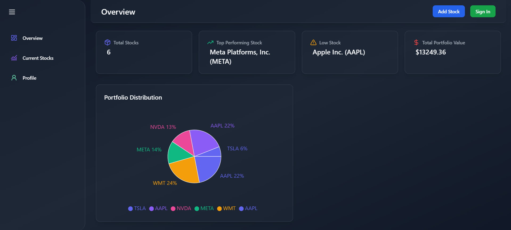
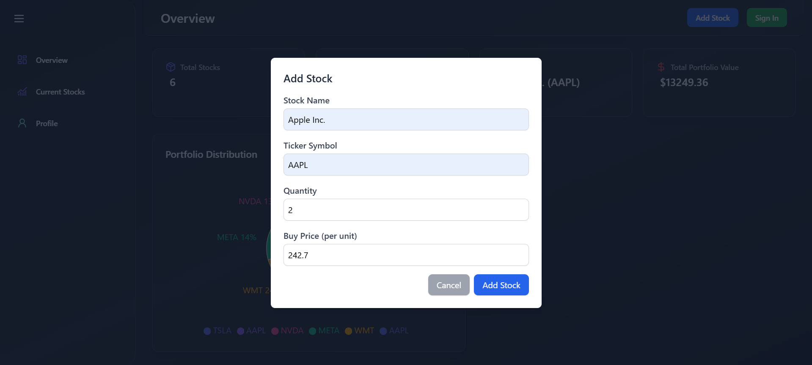
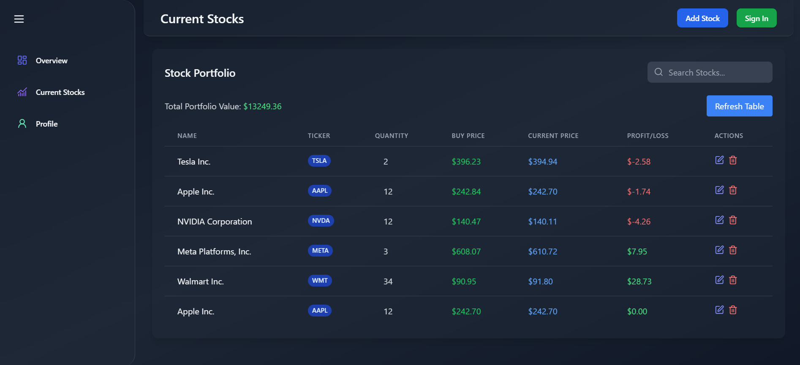
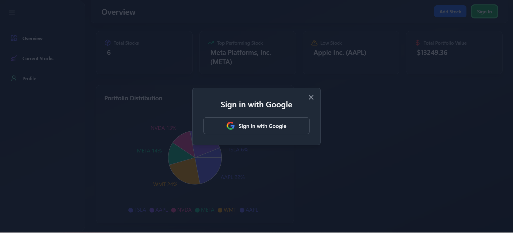
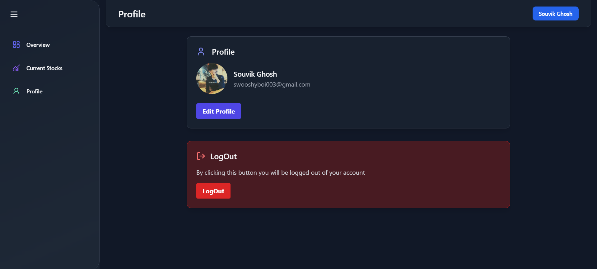

# Portfolio Tracker

A full-stack web application for managing stock portfolios, featuring Google OAuth authentication and real-time stock price tracking.

---

## Features

- **Google OAuth Integration**: Secure login using Google accounts.
- **Portfolio Management**: Add, edit, delete, and fetch stock holdings.
- **Real-Time Prices**: Display updated stock prices using the Finnhub API.

---

## Tech Stack

### Frontend

- **React.js** for UI
- **Tailwind CSS** for styling
- **React Router** for navigation

### Backend

- **Node.js** and **Express.js** for the server
- **MongoDB** as the database
- **Axios** for API requests

### APIs

- **Google OAuth** for authentication
- **Finnhub API** for fetching real-time stock prices

---

## Prerequisites

- **Node.js**: v16 or later
- **MongoDB**: Local or hosted instance
- **Google OAuth**: API credentials from the Google Developer Console

---

## Project Setup

### 1. Clone the Repository


```bash
git clone https://github.com/souvikree/Portfolio-Tracker.git
cd portfolio-tracker
```

### 2. Backend Setup

```bash
cd server
npm install
```

### 3. Configure Environment Variables

#### Create a `.env` file in the `backend` folder and add the following:

```bash
PORT=
MONGO_URI=your_mongodb_connection_string
GOOGLE_CLIENT_ID=your_google_client_id
GOOGLE_CLIENT_SECRET=your_google_client_secret
JWT_SECRET=your_jwt_secret
JWT_TIMEOUT=1h
FINNHUB_API_KEY=your_finnhub_api_key
```

### 4. Start the Backend Server

```bash
npm run dev
```

### 5. Frontend Setup

```bash
cd Portfolio-Tracker
npm install
```

### 3. Configure Environment Variables

#### Create a `.env` file in the `frontend` folder and add the following:

```bash
VITE_API_BASE_URL=your-deployed-backend-link
VITE_API_GOOGLE_BASE_URL=your-deployed-backend-link
VITE_API_BASE_URL_LOCAL=http://localhost:8080
VITE_FINNHUB_API_KEY=your_finnhub_api_key
VITE_GOOGLE_CLIENT_ID=your_google_client_id
GOOGLE_CLIENT_SECRET=your_google_client_secret
```

### 4. Start the Frontend 

```bash
npm run dev
```

## Useful Links

### Finnhub API Documentation

#### Explore the live Finnhub API documentation to understand how to fetch real-time stock data and other features:

https://finnhub.io/docs/api

## Deployed Application

### Access the deployed Portfolio Tracker application using the following link:

Deployed Portfolio Tracker : ` https://portfolio-tracker-ebon.vercel.app/ `


#### WebPage ScreenShots








